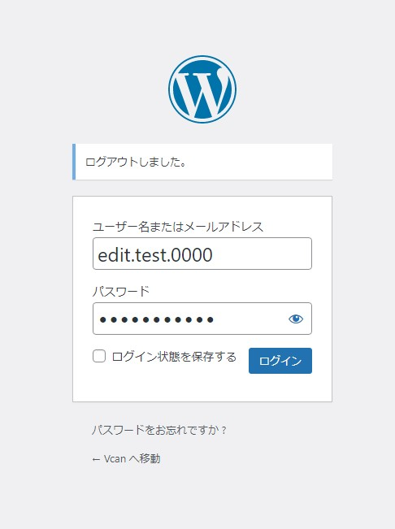

# アカウントの設定関連

ここではアカウントの設定に関しての説明を記載してあります。

## アカウントの新規作成について

アカウントを新規作成する場合には、管理者にメールアドレスと名前のアルファベット表記を連絡してください。管理者はその情報をもとにアカウントの作成を行います。

アカウントの作成が成功すると以下のようなメールが送られてきます。

!!!attention
    メールは迷惑メールに振り分けられていることがありますので、届かない場合には迷惑メールフォルダもチェックしてください。

メールに記載されているURLのうち、短いURLがログインページのリンクになりますので開いてください。→[ログインページ](https://www.vcan-hpv.org/shsfsa "ログインページ")

ログインページを開いたら、メールに記載されているユーザー名かメールアドレスと、別途送信している初期パスワードを入力してログインができれば初期設定は完了です。

!!!attention
    画面のユーザー名はサンプル用のテストアカウントです。

    edit.test.0000の部分は自分のメールアドレスやユーザー名に置き換えてください。

ログインが完了したら、プロフィールの設定やパスワードの変更を行います。

## プロフィールの変更方法について

ログインが完了したら、右上にある自分のユーザーIDをクリックします。

プロフィール設定画面が開くので、以下の部分は必ず設定してください。それ以外の部分は自由にしてもらって大丈夫です。

1. ニックネーム

    HP上で表示したい名前を入力してください。記事の執筆者欄に名前が出ます。

2. ブログ上の表示名

    先程設定したニックネームを選択してください。

3. 新しいパスワード

    「新しいパスワードを設定」をクリックするとランダムで生成されます。ランダムの文字列を消して自分の希望するパスワードに変更することも可能です。

上記以外の部分は自由に設定してください。