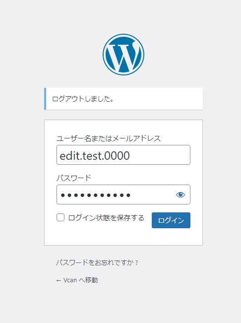
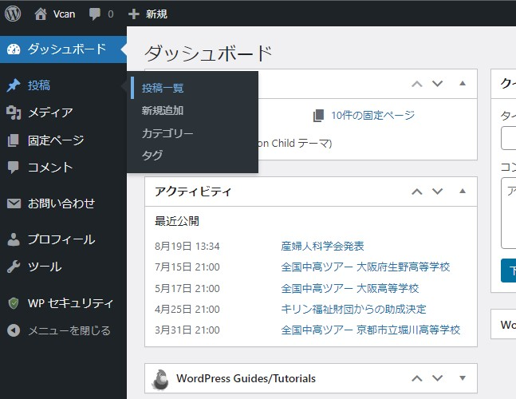
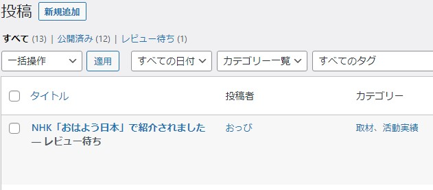
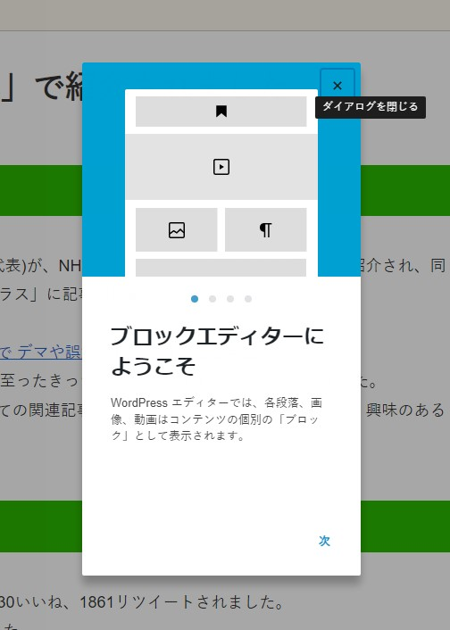
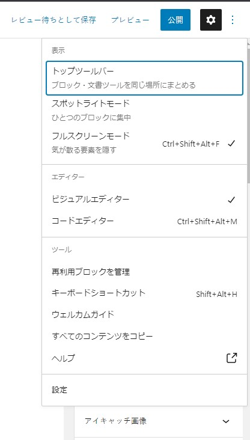
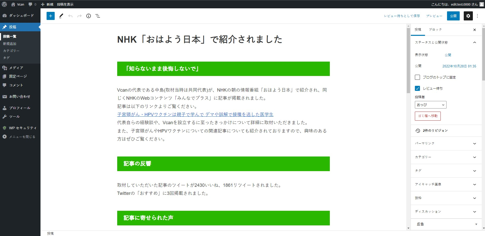
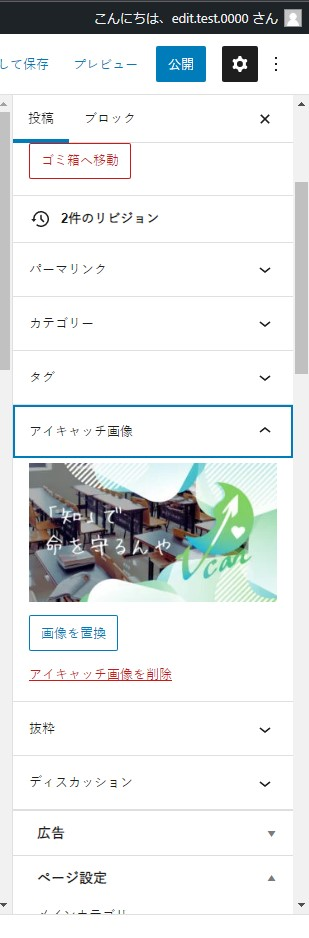
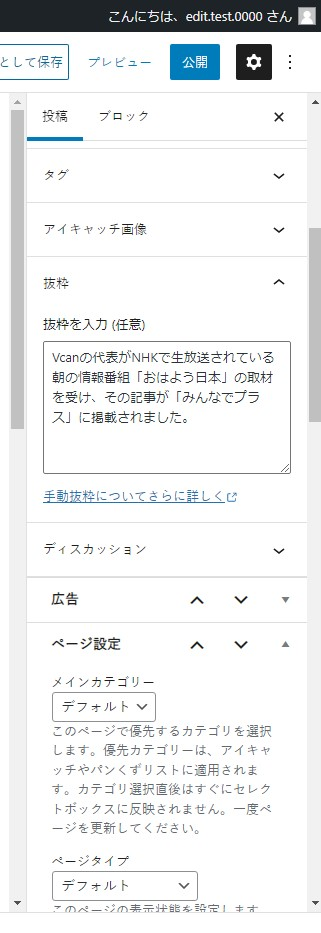
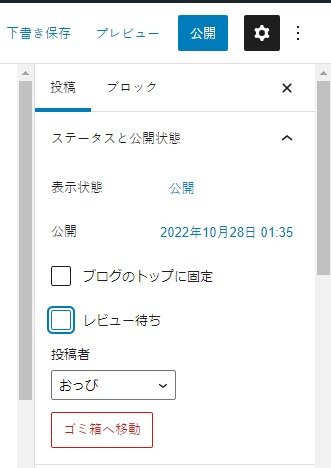
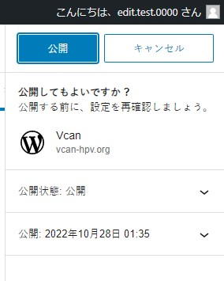

# 記事のレビューについて

## 「レビュー」とは

「レビュー」とは、執筆者もしくは別の編集者が書いた記事を別の人物が内容をチェックすることです。

このレビューをすることによって、誤字脱字の修正等の基本的な部分はもちろん、ソースの検証といった、特に医療系の分野について扱う我々にとって重要な部分についての確認を行うことができます。

## レビューのやり方

まずは、[アカウントの初期設定](../account "アカウントの初期設定")を参考に、HPの管理画面にログインするための初期設定を行ってください。

ログイン画面を開いたら、メールアドレスやユーザー名とパスワードを入力して「ログイン」をクリックします。

!!!attention
    画面のユーザー名はサンプル用のテストアカウントです。

    edit.test.0000の部分は自分のメールアドレスやユーザー名に置き換えてください。

ログインが成功すると「ダッシュボード」というページが開きます。

ダッシュボードの左側のメニューから「投稿」→「記事一覧」をクリックしてください。

記事一覧が表示されますので、「レビュー待ち」と書かれている記事をクリックしてください。

記事を開くと、初めて開いたときは、画面についての説明が出てきますので右上にある「ダイアログを閉じる」をクリックしして進めてください。

また、右上の縦に並んだ3つの点々を押すと、表示方法についての設定が出てくるので自分にあったものを選択してください。

「表示」の欄のチェックをつけたり外したりすると、編集画面が変わるので自分にあったものを選択してください。

画面に記事が表示されていますので、誤字や脱字、修正したい表現や追加したい表現があったら修正を加えてください。

## 記事のプレビューについて

実際にどのように表示されるかを確認したい場合には、画面右上の「プレビュー」→「新しいタブでプレビュー」をクリックすると、編集したものがどのように表示されるかわかります。

## 公開前にかならずチェックをするところ

記事の公開前には以下のことをチェックする必要があります。必ず確認してください。

**1.タイトルが設定されているかどうか**

タイトルとは、記事の一番上にある部分になります。このタイトルがそのままHPに掲載されますので誤字脱字の無いようにしてください。

**2.アイキャッチの画像が設定されているかどうか**

アイキャッチとは、記事を一覧に表示したときにトップに出てくる画像です。YouTubeでいうサムネイルになりますので、こちらもかなり重要です。

記事をSNSでシェアした際にもこの画像が大きく表示されますので、記事を公開するときは極力専用のアイキャッチの画像を作成しましょう。

アイキャッチが設定されているかの確認は、画面右のメニューを下にスクロールして表示される「アイキャッチ画像」の部分になります。

!!!tips
    アイキャッチのサイズは16:9(1920x1080)のサイズで最適化していますので、作成するときは参考にしてください。

**3.記事の抜粋は記入されているか**

画面右のメニューを下に動かしていくと、抜粋を入力する欄がありますので、必ず記事の抜粋を入力するようにしてください。

この抜粋とタイトルが、Google検索に引っかかりやすくするための設定になりますので、よく考えて記入をしてください。

基本的には記事のライターがここまで記入する必要がありますが、もし記入されていなかった場合には編集者が記入してください。

!!!tips
    記事の抜粋はおよそ120文字前後が良いとされています。スマホではそのうちの50文字が表示されますので、まずは50文字以内で記事が理解できるようにして、追加の詳細情報はそれ以降に120文字以内に納めるようにしてください。

## 記事を公開する

必要な修正が終わったら、画面右側のメニューにある「レビュー待ち」のチェックを外して、「公開」をクリックします。

!!!attention
    この段階でもう一度別の編集者に見てもらう必要がある時は、「レビュー待ち」のチェックをつけたまま、「レビュー待ちとして保存」をクリックします。

「公開しても良いですか？」という表示が出て、本当に記事を公開していいのかどうか聞かれますので、公開しない場合には「キャンセル」をクリックしてください。

!!!tips
    日時を指定して予約投稿をすることができます。

    公開前チェックの画面で、日時が書かれているところをクリックすることで任意の日時に指定することができます。

以上で記事の編集と公開は終了です。