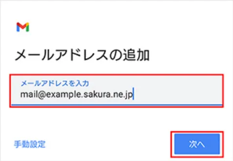

# Android版Gmailの場合

!!!attention
    使用しているアプリバージョンやデバイスによって表示に若干の違いがある場合があります。

    基本的にはセキュリティの面からも常に最新のアプリを利用するようにしてください。

## Step1 アカウントの追加と送受信サーバーの設定

1. Gmailアプリを起動します。

    !!!info
        Gmailアプリを初めて使う場合には、ログイン画面が表示されるので、ログインをタップしてください。

2. 画面左上の3本線をタップします。

    

3. 「設定」をタップします。

    

4. 「アカウントを追加する」をタップします。

    

5. 「その他」をタップします。

    

6. メールアドレスを入力し、「次へ」をタップします。

    

    !!!example
        入力するメールアドレスは、問い合わせ内容ごとに以下のとおりです。

        **今後「メールアドレス」と記載がある場所はここで入力したメールアドレスのことを指します。**

        |        問い合わせ内容        |    メールアドレス    |
        | :--------------------------: | :------------------: |
        |        ご支援について        | support@vcan-hpv.org |
        | Vcanメンバー加入希望について | recruit@vcan-hpv.org |
        |      中高ツアーについて      |  tour@vcan-hpv.org   |
        |      企画・協賛について      | sho-gai@vcan-hpv.org |
        |        その他について        |  info@vcan-hpv.org   |
        |        イベントについて        |  event@vcan-hpv.org   |

7. 「個人用(POP3)」をタップします。

    

8. パスワード欄に別途送信したパスワードを入力します。

    

9. 受信サーバーの設定項目を入力し、「次へ」をタップします。

    

    !!!example
        各項目の入力欄は以下の通りです。

        |表示項目|入力内容|
        |:-:|:-:|
        |ユーザ名|メールアドレス|
        |パスワード|別途送信しているパスワード|
        |サーバー|vcan-hpv.sakura.ne.jp|
        |サーバーからメールを削除|受信トレイから削除したとき|

10. 送信サーバーの設定項目を入力し、「次へ」をタップします。

    

    !!!example
        各項目の入力欄は以下の通りです。

        |表示項目|入力内容|
        |:-:|:-:|
        |ユーザ名|メールアドレス|
        |パスワード|別途送信しているパスワード|
        |SMTPサーバー|vcan-hpv.sakura.ne.jp|

11. アカウントオプション画面が表示されます。使いやすいように設定してください。

    

12. アカウントの設定完了画面が表示されます。アカウント名と名前を入力し、「次へ」を入力してください。

    

    !!!example
        アカウント名にはメールアドレスを入力してください。

        名前欄はメールアドレスごとに異なります。以下を参照して入力してください。

        **ここで入力した名前が送信メールに表示されます。必ず統一してください。**

        |メールアドレス|入力する名前|
        |:-:|:-:|
        |support@vcan-hpv.org|Vcan-ご支援受付担当|
        |recruit@vcan-hpv.org|Vcan-新メンバー担当|
        |tour@vcan-hpv.org|Vcan-中高ツアー担当|
        |sho-gai@vcan-hpv.org|Vcan-渉外対応担当|
        |event@vcan-hpv.org|Vcan-イベント担当|
        |info@vcan-hpv.org|Vcan-お問い合わせ対応|

## Step2 詳細設定の確認

1. 詳細設定を確認するため、画面左上の3本線をタップします。

    

2. 「設定」をタップします。

    

3. 作成したアカウント(メールアドレス)をタップします。

    

4. 「受信設定」をタップします。

    

5. 設定項目を確認し、「完了」をタップします。

    

    !!!example
        各項目の入力欄は以下の通りです。

        違った場合には修正してください。

        |表示項目|入力内容|
        |:-:|:-:|
        |ユーザ名|メールアドレス|
        |パスワード|別途送信しているパスワード|
        |サーバー|vcan-hpv.sakura.ne.jp|
        |ポート|995|
        |セキュリティの種類|SSL/TLS|

6. 「送信設定」をタップします。

    

7. 設定項目を確認し、「完了」をタップします。

    

    !!!example
        各項目の入力欄は以下の通りです。

        違った場合には修正してください。

        |表示項目|入力内容|
        |:-:|:-:|
        |ユーザ名|メールアドレス|
        |パスワード|別途送信しているパスワード|
        |SMTPサーバー|vcan-hpv.sakura.ne.jp|
        |ポート|587|
        |セキュリティの種類|STARTTLS|

8. これで設定は完了です。

!!!attention
    実際に問い合わせが来たときの返信方法にも注意点がありますので、別途対応方法についてを参照してください。
