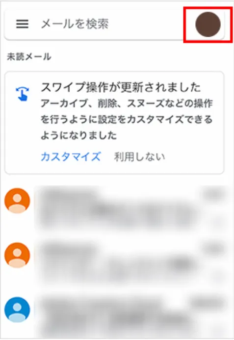
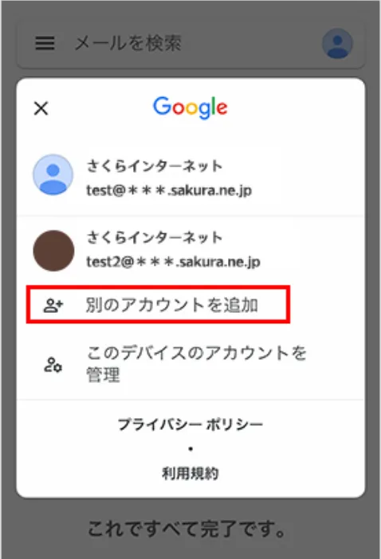
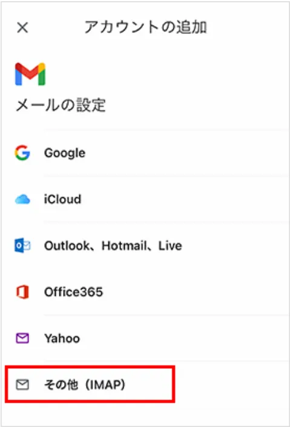
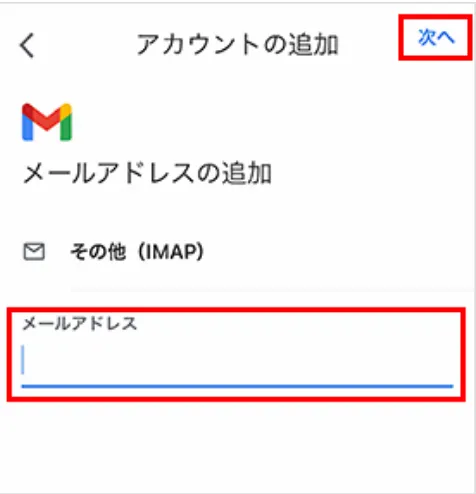
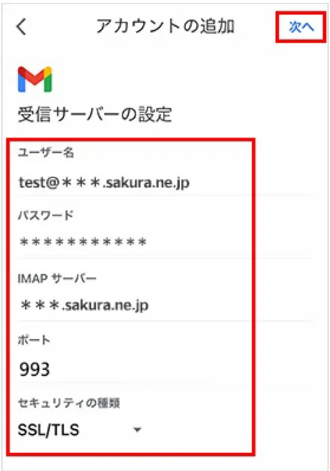
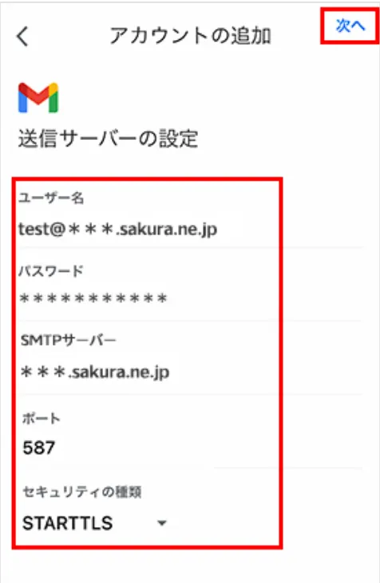
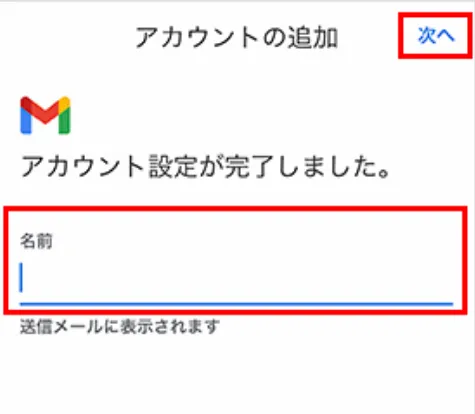

# iOS/iPadOS版Gmailの場合

!!!attention
    使用しているアプリのバージョンによって表示に若干の違いがある場合があります。

    基本的にはセキュリティの面からも常に最新のアプリを利用するようにしてください。

## アカウントの追加と送受信サーバーの設定

1. Gmailアプリを起動します。

    !!!info
        Gmailアプリを初めて使う場合には、ログイン画面が表示されるので、ログインをタップしてください。

2. 画面右上のプロフィール写真(丸いアイコン)をタップします。

    

3. 「別のアカウントを追加」をタップします。

    

4. 「その他(IMAP)」をタップします。

    

5. 設定する「メールアドレス」を入力し、「次へ」をタップします。

    

    !!!example
        入力するメールアドレスは、問い合わせ内容ごとに以下のとおりです。

        **今後「メールアドレス」と記載がある場所はここで入力したメールアドレスのことを指します。**

        |        問い合わせ内容        |    メールアドレス    |
        | :--------------------------: | :------------------: |
        |        ご支援について        | support@vcan-hpv.org |
        | Vcanメンバー加入希望について | recruit@vcan-hpv.org |
        |      中高ツアーについて      |  tour@vcan-hpv.org   |
        |      企画・協賛について      | sho-gai@vcan-hpv.org |
        |        その他について        |  info@vcan-hpv.org   |

6. 受信サーバーの設定項目を入力し、「次へ」をタップします。

    

    !!!example
        各項目の入力欄は以下の通りです。

        |表示項目|入力内容|
        |:-:|:-:|
        |ユーザ名|メールアドレス|
        |パスワード|別途送信しているパスワード|
        |サーバー|vcan-hpv.sakura.ne.jp|
        |ポート|993|
        |セキュリティの種類|SSL/TLS|

7. 送信サーバーの設定項目を入力し、「次へ」をタップします。

    

    !!!example
        各項目の入力欄は以下の通りです。

        |表示項目|入力内容|
        |:-:|:-:|
        |ユーザ名|メールアドレス|
        |パスワード|別途送信しているパスワード|
        |SMTPサーバー|vcan-hpv.sakura.ne.jp|
        |ポート|587|
        |セキュリティの種類|STARTTLS|

8. 名前欄に名前を入力します。

    

    !!! attention
        **メールアドレスごとに入力する名前が異なりますが、必ずアドレスごとに統一してください。

        ここで入力した名前が送信したメールの名前欄に表示されます。**

        |メールアドレス|入力する名前|
        |:-:|:-:|
        |support@vcan-hpv.org|Vcan-ご支援受付担当|
        |recruit@vcan-hpv.org|Vcan-新メンバー担当|
        |tour@vcan-hpv.org|Vcan-中高ツアー担当|
        |sho-gai@vcan-hpv.org|Vcan-渉外対応担当|
        |info@vcan-hpv.org|Vcan-お問い合わせ対応|

9. 完了画面が表示されると、設定は完了です。

    

!!!attention
    実際に問い合わせが来たときの返信方法にも注意点がありますので、別途対応方法についてを参照してください。
