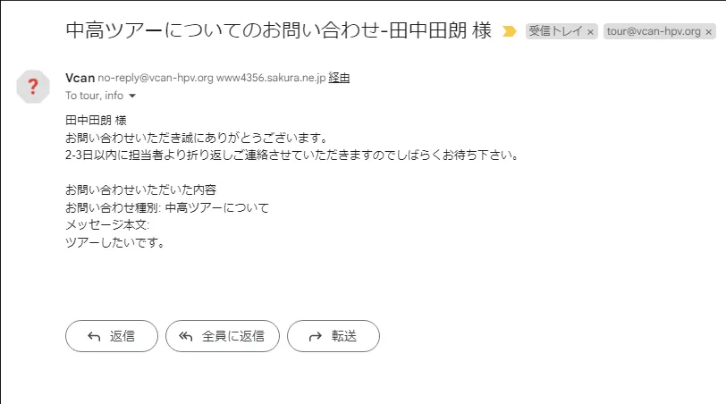
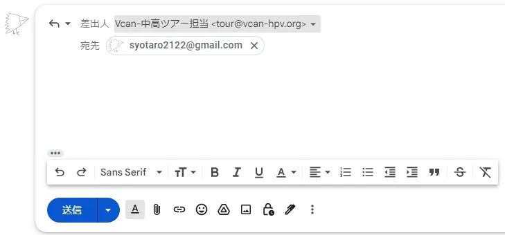

# 問い合わせへの対応方法

## 問い合わせが来た場合

以下のようなメールが届きます。

このメールに「返信」ボタンから返信してください。

!!!attention
    返信時には、必ずVcanのアカウントから返信するように選択してください。

    

    個人のGmailのアカウントがデフォルトで選択されていることがほとんどなので必ず確認してVcanのメールアドレスで返信するようにしてください。

**返信時には必ずCCに「info@vcan-hpv.org」を入れるようにしてください**

これはすべてのやり取りが適切に行われているか、対応漏れがないか等を確認するためのものです。徹底してください。
