# Web版Gmailの場合

## Step1 Gmailにログイン

ブラウザからGmailにログインします。

## Step2 メールアカウント設定画面の表示

1. 右上の歯車マークのアイコンをクリックし、「すべての設定を表示」をクリックします。

    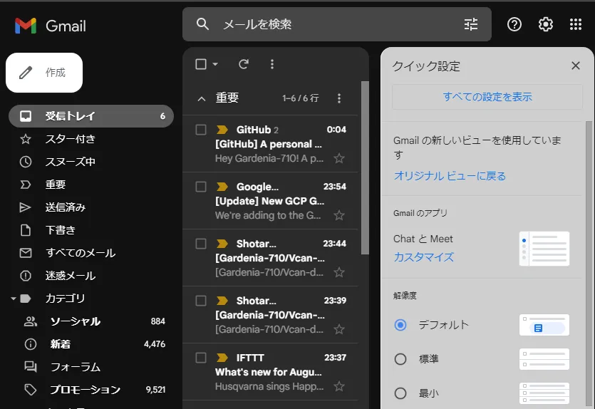

2. 「アカウントとインポート」タブ内「他のアカウントのメールを確認」の「メールアカウントを追加する」をクリックします。

    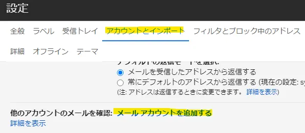

## Step3 メールアカウントの追加

1. メールアドレスを入力し、「次へ」をクリックします。

    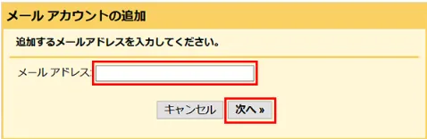

    !!!example
        入力するメールアドレスは、問い合わせ内容ごとに以下のとおりです。

        **今後「メールアドレス」と記載がある場所はここで入力したメールアドレスのことを指します。**

        |        問い合わせ内容        |    メールアドレス    |
        | :--------------------------: | :------------------: |
        |        ご支援について        | support@vcan-hpv.org |
        | Vcanメンバー加入希望について | recruit@vcan-hpv.org |
        |      中高ツアーについて      |  tour@vcan-hpv.org   |
        |      企画・協賛について      | sho-gai@vcan-hpv.org |
        |        その他について        |  info@vcan-hpv.org   |
        |        イベントについて        |  event@vcan-hpv.org   |

2. 「他のアカウントからメールを読み込む(POP3)」を選択して、「次へ」をクリックします。

    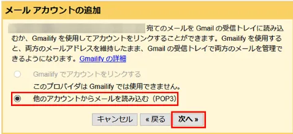

## Step4 メールアカウントの受信設定

1. 以下項目をすべて入力します。その後「アカウント追加」をクリックします。

    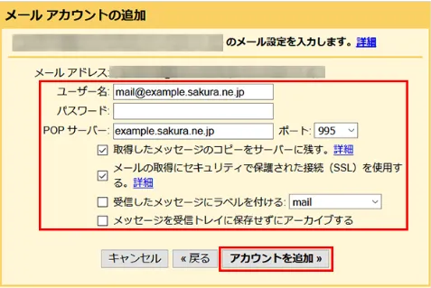

    !!! example
        それぞれの入力欄は以下のように入力してください。

        |表示項目|入力内容|
        |:-:|:-:|
        |ユーザ名|メールアドレス|
        |パスワード|別途送信しているパスワード|
        |POPサーバー|vcan-hpv.sakura.ne.jp|
        |ポート|995|
        |取得したメッセージのコピーをサーバーに残す|チェックあり|
        |メールの取得にセキュリティで保護された接続(SSL)を使用する|チェックあり|
        |メッセージを受信トレイに保存せずにアーカイブする|チェックなし|

2. メールの受信ができるようになります。

    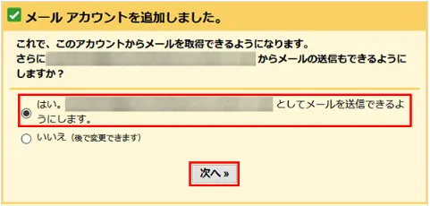

    「はい。{メールアドレス}としてメールを送信できるようにします。を選択して「次へ」をクリック。

## Step5 メールアカウントの送信設定

1. 以下項目を入力し、「次のステップをクリック」

    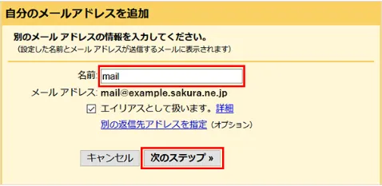

    !!! attention
        **メールアドレスごとに入力する名前が異なりますが、必ずアドレスごとに統一してください。

        ここで入力した名前が送信したメールの名前欄に表示されます。**

        |メールアドレス|入力する名前|
        |:-:|:-:|
        |support@vcan-hpv.org|Vcan-ご支援受付担当|
        |recruit@vcan-hpv.org|Vcan-新メンバー担当|
        |tour@vcan-hpv.org|Vcan-中高ツアー担当|
        |sho-gai@vcan-hpv.org|Vcan-渉外対応担当|
        |event@vcan-hpv.org|Vcan-イベント担当|
        |info@vcan-hpv.org|Vcan-お問い合わせ対応|

2. 以下の項目をすべて入力して「アカウントを追加」をクリックします。

    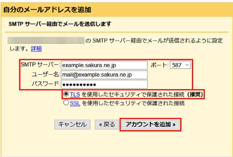

    !!! example
        各入力欄は以下のように入力してください。

        |入力欄|入力内容|
        |:-:|:-:|
        |SMTPサーバー|vcan-hpv.sakura.ne.jp|
        |ポート|587|
        |ユーザ名|メールアドレス|
        |パスワード|別途送信しているパスワード|
        |セキュリティで保護された通信|「TLSを使用したセキュリティで保護された通信(推奨)」を選択|

3. 以下の画面が入力されます。

    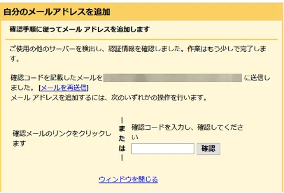

4. その後しばらくするとGmailの受信トレイに「確認メール」が届きます。

    メールに記載のリンクをクリックしてください。

    !!!info
        もしメールに記載のリンクがクリックできない場合には、本文記載の確認コードを先程の画面に入力してください。

    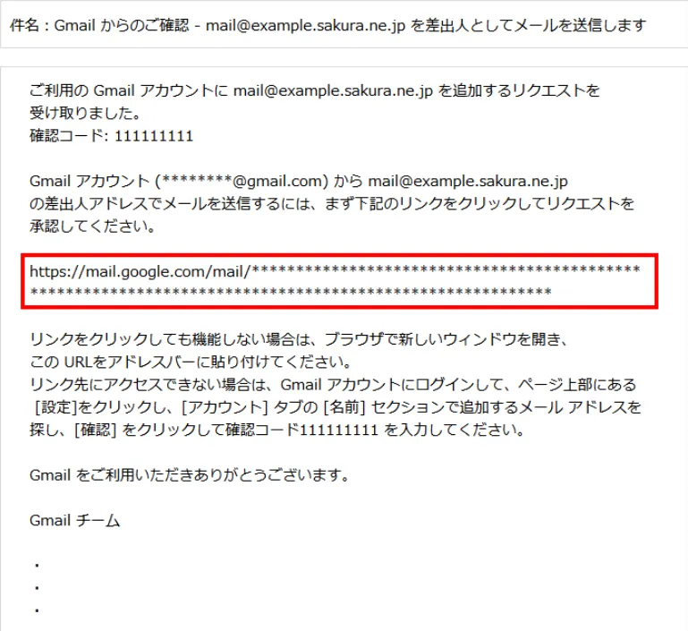

5. 以下の画面にて、「確認」をクリックします。

    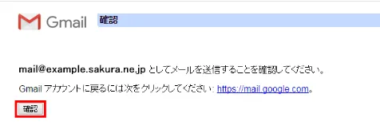

6. これで設定は完了です。

    手順3で出てきた確認コードの入力画面は閉じてしまって大丈夫です。

    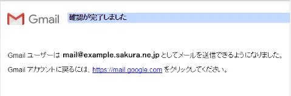

!!! attention
    実際に問い合わせが来たときの返信方法にも注意点がありますので、別途対応方法についてを参照してください。
